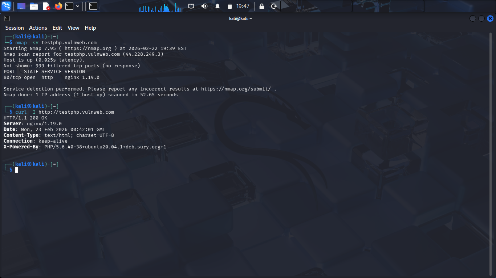
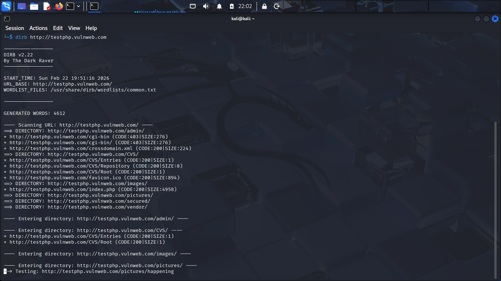

# FUTURE_CS_01 – Vulnerability Assessment Report

## Cyber Security Track – Task 1

---

## Table of Contents

- [Overview](#overview)

- [Task Objectives](#task-objectives)

- [Tools Used](#tools-used)

- [Assessment Findings](#assessment-findings)

- [Risk Assessment](#risk-assessment)

- [Recommendations](#recommendations)

- [Report](#report)

- [Disclaimer](#disclaimer)

---

## Overview

This repository documents a structured vulnerability assessment conducted on:

http://testphp.vulnweb.com

The objective of this task was to identify exposed services, outdated technologies, and potential security risks using reconnaissance and enumeration techniques.

This assessment was conducted in a controlled lab environment for educational purposes only.

---

## Task Objectives

- Identify open ports

- Detect running services and versions

- Analyze HTTP headers

- Review web application source code

- Perform directory enumeration

- Assess risks

- Provide remediation recommendations

---

## Tools Used

- Nmap

- curl

- dirb

- Kali Linux

- Browser Developer Tools

---

## Assessment Findings

### 1️. Port & Service Discovery

- Open Port: 80/tcp

- Service: HTTP

- Server: nginx 1.19.0

- No additional open ports identified

### 2️. HTTP Header Analysis

- Server: nginx/1.19.0

- X-Powered-By: PHP/5.6.40 (End-of-Life)

### 3️. Web Application Analysis

- HTML 4.01 Transitional detected

- Character encoding: iso-8859-2

- Backend: PHP 5.6.40

### 4. Directory Enumeration

Accessible directories:
- /images/

- /pictures/

- /css/

- /js/

- /admin/

---

## Risk Assessment

- Outdated PHP version (5.6.40)

- Server version disclosure

- Exposed web directories

Unsupported software increases the risk of exploitation through publicly known vulnerabilities.

---

## Recommendations

- Upgrade PHP

- Update nginx

- Disable version disclosure

- Implement patch management

- Conduct periodic assessments

---

## Report

The full vulnerability assessment report can be accessed below:
[Download Full Report (PDF)](report/Web_Security_Assessment_Report.pdf)

---

## Disclaimer

This project was conducted strictly for educational purposes in a controlled lab environment. No exploitation was performed.
